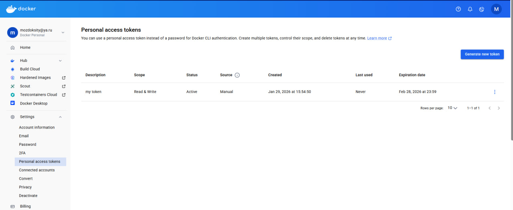
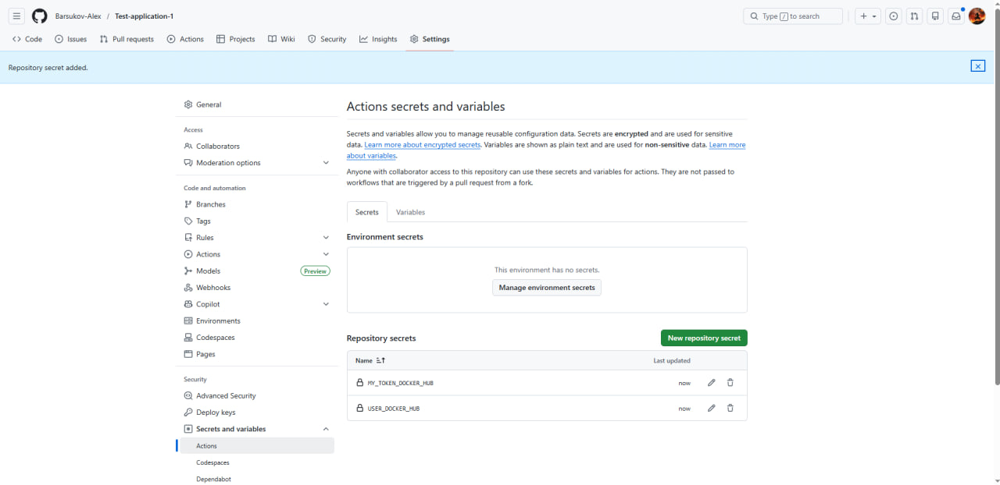
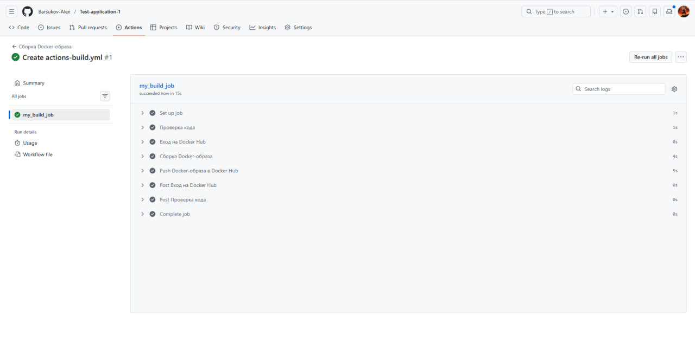
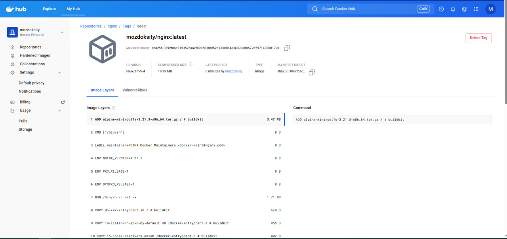

# Дипломный практикум в Yandex.Cloud выполнил Барсуков Алексей
  * [Цели:](#цели)
  * [Этапы выполнения:](#этапы-выполнения)
     * [Создание облачной инфраструктуры](#создание-облачной-инфраструктуры)
     * [Создание Kubernetes кластера](#создание-kubernetes-кластера)
     * [Создание тестового приложения](#создание-тестового-приложения)
     * [Подготовка cистемы мониторинга и деплой приложения](#подготовка-cистемы-мониторинга-и-деплой-приложения)
     * [Установка и настройка CI/CD](#установка-и-настройка-cicd)
  * [Что необходимо для сдачи задания?](#что-необходимо-для-сдачи-задания)
  * [Как правильно задавать вопросы дипломному руководителю?](#как-правильно-задавать-вопросы-дипломному-руководителю)

**Перед началом работы над дипломным заданием изучите [Инструкция по экономии облачных ресурсов](https://github.com/netology-code/devops-materials/blob/master/cloudwork.MD).**

---
## Цели:

1. Подготовить облачную инфраструктуру на базе облачного провайдера Яндекс.Облако.
2. Запустить и сконфигурировать Kubernetes кластер.
3. Установить и настроить систему мониторинга.
4. Настроить и автоматизировать сборку тестового приложения с использованием Docker-контейнеров.
5. Настроить CI для автоматической сборки и тестирования.
6. Настроить CD для автоматического развёртывания приложения.

---
## Этапы выполнения:


### Создание облачной инфраструктуры

<details>
	<summary></summary>
      <br>

Для начала необходимо подготовить облачную инфраструктуру в ЯО при помощи [Terraform](https://www.terraform.io/).

Особенности выполнения:

- Бюджет купона ограничен, что следует иметь в виду при проектировании инфраструктуры и использовании ресурсов;
Для облачного k8s используйте региональный мастер(неотказоустойчивый). Для self-hosted k8s минимизируйте ресурсы ВМ и долю ЦПУ. В обоих вариантах используйте прерываемые ВМ для worker nodes.

Предварительная подготовка к установке и запуску Kubernetes кластера.

1. Создайте сервисный аккаунт, который будет в дальнейшем использоваться Terraform для работы с инфраструктурой с необходимыми и достаточными правами. Не стоит использовать права суперпользователя
2. Подготовьте [backend](https://developer.hashicorp.com/terraform/language/backend) для Terraform:  
   а. Рекомендуемый вариант: S3 bucket в созданном ЯО аккаунте(создание бакета через TF)
   б. Альтернативный вариант:  [Terraform Cloud](https://app.terraform.io/)
3. Создайте конфигурацию Terrafrom, используя созданный бакет ранее как бекенд для хранения стейт файла. Конфигурации Terraform для создания сервисного аккаунта и бакета и основной инфраструктуры следует сохранить в разных папках.
4. Создайте VPC с подсетями в разных зонах доступности.
5. Убедитесь, что теперь вы можете выполнить команды `terraform destroy` и `terraform apply` без дополнительных ручных действий.
6. В случае использования [Terraform Cloud](https://app.terraform.io/) в качестве [backend](https://developer.hashicorp.com/terraform/language/backend) убедитесь, что применение изменений успешно проходит, используя web-интерфейс Terraform cloud.

Ожидаемые результаты:

1. Terraform сконфигурирован и создание инфраструктуры посредством Terraform возможно без дополнительных ручных действий, стейт основной конфигурации сохраняется в бакете или Terraform Cloud
2. Полученная конфигурация инфраструктуры является предварительной, поэтому в ходе дальнейшего выполнения задания возможны изменения.

</details>


## Решение:

Подготовим облачную инфраструктуру в Яндекс.Облако при помощи Terraform.

### 1.1. Создадим сервисный аккаунт, который будет в дальнейшем использоваться Terraform для работы с инфраструктурой с необходимыми и достаточными правами.

```hcl
# Создание сервисного аккаунта для Terraform
resource "yandex_iam_service_account" "service" {
  name      = var.account_name
  description = "service account to manage VMs"
  folder_id = var.folder_id
}

# Назначение роли editor сервисному аккаунту
resource "yandex_resourcemanager_folder_iam_member" "editor" {
  folder_id = var.folder_id
  role      = "editor"
  member    = "serviceAccount:${yandex_iam_service_account.service.id}"
  depends_on = [yandex_iam_service_account.service]
}

# Создание статического ключа доступа для сервисного аккаунта
resource "yandex_iam_service_account_static_access_key" "terraform_service_account_key" {
  service_account_id = yandex_iam_service_account.service.id
  description        = "static access key for object storage"
}
```

---
### 1.2. Подготовим backend для Terraform:  

```hcl
# Создадим бакет с использованием ключа
resource "yandex_storage_bucket" "state_storage" {
  bucket     = local.bucket_name
  access_key = yandex_iam_service_account_static_access_key.terraform_service_account_key.access_key
  secret_key = yandex_iam_service_account_static_access_key.terraform_service_account_key.secret_key

  anonymous_access_flags {
    read = false
    list = false
  }
}

# Локальная переменная отвечающая за текущую дату в названии бакета
locals {
    current_timestamp = timestamp()
    formatted_date = formatdate("DD-MM-YYYY", local.current_timestamp)
    bucket_name = "state-storage-${local.formatted_date}"
}

# Создание объекта в существующей папке
resource "yandex_storage_object" "backend" {
  access_key = yandex_iam_service_account_static_access_key.terraform_service_account_key.access_key
  secret_key = yandex_iam_service_account_static_access_key.terraform_service_account_key.secret_key
  bucket = local.bucket_name
  key    = "terraform.tfstate"
  source = "./terraform.tfstate"
  depends_on = [yandex_storage_bucket.state_storage]
}
```

---
### 1.3. Создадим VPC с подсетями в разных зонах доступности.

```hcl
#Создание пустой VPC
resource "yandex_vpc_network" "vpc0" {
  name = var.vpc_name
}

#Создадим в VPC subnet c названием subnet-a
resource "yandex_vpc_subnet" "subnet-a" {
  name           = var.subnet-a
  zone           = var.zone-a
  network_id     = yandex_vpc_network.vpc0.id
  v4_cidr_blocks = var.cidr-a
}

#Создание в VPC subnet с названием subnet-b
resource "yandex_vpc_subnet" "subnet-b" {
  name           = var.subnet-b
  zone           = var.zone-b
  network_id     = yandex_vpc_network.vpc0.id
  v4_cidr_blocks = var.cidr-b
}

#Создание в VPC subnet с названием subnet-d
resource "yandex_vpc_subnet" "subnet-d" {
  name           = var.subnet-d
  zone           = var.zone-d
  network_id     = yandex_vpc_network.vpc0.id
  v4_cidr_blocks = var.cidr-d
}


variable "vpc_name" {
  type        = string
  default     = "vpc0"
  description = "VPC network"
}

variable "subnet-a" {
  type        = string
  default     = "subnet-a"
  description = "subnet name"
}

variable "subnet-b" {
  type        = string
  default     = "subnet-b"
  description = "subnet name"
}

variable "subnet-d" {
  type        = string
  default     = "subnet-d"
  description = "subnet name"
}

variable "zone-a" {
  type        = string
  default     = "ru-central1-a"
  description = "https://cloud.yandex.ru/docs/overview/concepts/geo-scope"
}

variable "zone-b" {
  type        = string
  default     = "ru-central1-b"
  description = "https://cloud.yandex.ru/docs/overview/concepts/geo-scope"
}

variable "zone-d" {
  type        = string
  default     = "ru-central1-d"
  description = "https://cloud.yandex.ru/docs/overview/concepts/geo-scope"
}

variable "cidr-a" {
  type        = list(string)
  default     = ["10.0.1.0/24"]
  description = "https://cloud.yandex.ru/docs/vpc/operations/subnet-create"
}

variable "cidr-b" {
  type        = list(string)
  default     = ["10.0.2.0/24"]
  description = "https://cloud.yandex.ru/docs/vpc/operations/subnet-create"
}

variable "cidr-d" {
  type        = list(string)
  default     = ["10.0.3.0/24"]
  description = "https://cloud.yandex.ru/docs/vpc/operations/subnet-create"
}
```

### 1.4. Убедимся, что теперь выполняется команды `terraform apply` без дополнительных ручных действий.
<details>
	<summary></summary>
      <br>

```bash
barsukov@barsukov:~/devops-diplom-yandexcloud-1/1_TASK/config/terraform$ terraform apply

Terraform used the selected providers to generate the following execution plan. Resource actions are indicated with the following symbols:
  + create

Terraform will perform the following actions:

  # yandex_iam_service_account.service will be created
  + resource "yandex_iam_service_account" "service" {
      + created_at         = (known after apply)
      + description        = "service account to manage VMs"
      + folder_id          = "b1g6id4gd3l1ivm8l812"
      + id                 = (known after apply)
      + labels             = (known after apply)
      + name               = "barsukov-nv"
      + service_account_id = (known after apply)
    }

  # yandex_iam_service_account_static_access_key.terraform_service_account_key will be created
  + resource "yandex_iam_service_account_static_access_key" "terraform_service_account_key" {
      + access_key                   = (known after apply)
      + created_at                   = (known after apply)
      + description                  = "static access key for object storage"
      + encrypted_secret_key         = (known after apply)
      + id                           = (known after apply)
      + key_fingerprint              = (known after apply)
      + output_to_lockbox_version_id = (known after apply)
      + secret_key                   = (sensitive value)
      + service_account_id           = (known after apply)
    }

  # yandex_resourcemanager_folder_iam_member.editor will be created
  + resource "yandex_resourcemanager_folder_iam_member" "editor" {
      + folder_id = "b1g6id4gd3l1ivm8l812"
      + member    = (known after apply)
      + role      = "editor"
    }

  # yandex_storage_bucket.state_storage will be created
  + resource "yandex_storage_bucket" "state_storage" {
      + access_key            = (known after apply)
      + acl                   = (known after apply)
      + bucket                = (known after apply)
      + bucket_domain_name    = (known after apply)
      + default_storage_class = (known after apply)
      + folder_id             = (known after apply)
      + force_destroy         = false
      + id                    = (known after apply)
      + policy                = (known after apply)
      + secret_key            = (sensitive value)
      + website_domain        = (known after apply)
      + website_endpoint      = (known after apply)

      + anonymous_access_flags {
          + list = false
          + read = false
        }

      + grant (known after apply)

      + versioning (known after apply)
    }

  # yandex_storage_object.backend will be created
  + resource "yandex_storage_object" "backend" {
      + access_key   = (known after apply)
      + acl          = "private"
      + bucket       = (known after apply)
      + content_type = (known after apply)
      + id           = (known after apply)
      + key          = "terraform.tfstate"
      + secret_key   = (sensitive value)
      + source       = "./terraform.tfstate"
    }

  # yandex_vpc_network.vpc0 will be created
  + resource "yandex_vpc_network" "vpc0" {
      + created_at                = (known after apply)
      + default_security_group_id = (known after apply)
      + folder_id                 = (known after apply)
      + id                        = (known after apply)
      + labels                    = (known after apply)
      + name                      = "vpc0"
      + subnet_ids                = (known after apply)
    }

  # yandex_vpc_subnet.subnet-a will be created
  + resource "yandex_vpc_subnet" "subnet-a" {
      + created_at     = (known after apply)
      + folder_id      = (known after apply)
      + id             = (known after apply)
      + labels         = (known after apply)
      + name           = "subnet-a"
      + network_id     = (known after apply)
      + v4_cidr_blocks = [
          + "10.0.1.0/24",
        ]
      + v6_cidr_blocks = (known after apply)
      + zone           = "ru-central1-a"
    }

  # yandex_vpc_subnet.subnet-b will be created
  + resource "yandex_vpc_subnet" "subnet-b" {
      + created_at     = (known after apply)
      + folder_id      = (known after apply)
      + id             = (known after apply)
      + labels         = (known after apply)
      + name           = "subnet-b"
      + network_id     = (known after apply)
      + v4_cidr_blocks = [
          + "10.0.2.0/24",
        ]
      + v6_cidr_blocks = (known after apply)
      + zone           = "ru-central1-b"
    }

  # yandex_vpc_subnet.subnet-d will be created
  + resource "yandex_vpc_subnet" "subnet-d" {
      + created_at     = (known after apply)
      + folder_id      = (known after apply)
      + id             = (known after apply)
      + labels         = (known after apply)
      + name           = "subnet-d"
      + network_id     = (known after apply)
      + v4_cidr_blocks = [
          + "10.0.3.0/24",
        ]
      + v6_cidr_blocks = (known after apply)
      + zone           = "ru-central1-d"
    }

Plan: 9 to add, 0 to change, 0 to destroy.

Do you want to perform these actions?
  Terraform will perform the actions described above.
  Only 'yes' will be accepted to approve.

  Enter a value: yes

yandex_vpc_network.vpc0: Creating...
yandex_iam_service_account.service: Creating...
yandex_vpc_network.vpc0: Creation complete after 2s [id=enp1r8ukdlbsp80490jt]
yandex_vpc_subnet.subnet-d: Creating...
yandex_vpc_subnet.subnet-b: Creating...
yandex_vpc_subnet.subnet-a: Creating...
yandex_vpc_subnet.subnet-a: Creation complete after 1s [id=e9bdroop67ob3rto4t8h]
yandex_vpc_subnet.subnet-b: Creation complete after 1s [id=e2li72gjgdpkrpko19vj]
yandex_vpc_subnet.subnet-d: Creation complete after 2s [id=fl8a122ciavq89ivhslh]
yandex_iam_service_account.service: Creation complete after 4s [id=ajegjb3i5mp00khb6kl5]
yandex_iam_service_account_static_access_key.terraform_service_account_key: Creating...
yandex_resourcemanager_folder_iam_member.editor: Creating...
yandex_iam_service_account_static_access_key.terraform_service_account_key: Creation complete after 1s [id=ajeqoatg890o6epqfirf]
yandex_storage_bucket.state_storage: Creating...
yandex_resourcemanager_folder_iam_member.editor: Creation complete after 2s
yandex_storage_bucket.state_storage: Creation complete after 9s [id=state-storage-29-01-2026]
yandex_storage_object.backend: Creating...
yandex_storage_object.backend: Creation complete after 1s [id=terraform.tfstate]

Apply complete! Resources: 9 added, 0 changed, 0 destroyed.
```

</details>


Проверим созданные ресурсы с помощью CLI


```bash

barsukov@barsukov:~/devops-diplom-yandexcloud-1/1_TASK/config/terraform$ yc vpc network list
+----------------------+------+
|          ID          | NAME |
+----------------------+------+
| enp1r8ukdlbsp80490jt | vpc0 |
+----------------------+------+

barsukov@barsukov:~/devops-diplom-yandexcloud-1/1_TASK/config/terraform$ yc vpc subnet list
+----------------------+----------+----------------------+----------------+---------------+---------------+
|          ID          |   NAME   |      NETWORK ID      | ROUTE TABLE ID |     ZONE      |     RANGE     |
+----------------------+----------+----------------------+----------------+---------------+---------------+
| e2li72gjgdpkrpko19vj | subnet-b | enp1r8ukdlbsp80490jt |                | ru-central1-b | [10.0.2.0/24] |
| e9bdroop67ob3rto4t8h | subnet-a | enp1r8ukdlbsp80490jt |                | ru-central1-a | [10.0.1.0/24] |
| fl8a122ciavq89ivhslh | subnet-d | enp1r8ukdlbsp80490jt |                | ru-central1-d | [10.0.3.0/24] |
+----------------------+----------+----------------------+----------------+---------------+---------------+

barsukov@barsukov:~/devops-diplom-yandexcloud-1/1_TASK/config/terraform$ yc storage bucket list
+--------------------------+----------------------+----------+-----------------------+---------------------+
|           NAME           |      FOLDER ID       | MAX SIZE | DEFAULT STORAGE CLASS |     CREATED AT      |
+--------------------------+----------------------+----------+-----------------------+---------------------+
| state-storage-29-01-2026 | b1g6id4gd3l1ivm8l812 |        0 | STANDARD              | 2026-01-29 06:17:47 |
+--------------------------+----------------------+----------+-----------------------+---------------------+

barsukov@barsukov:~/devops-diplom-yandexcloud-1/1_TASK/config/terraform$ yc storage bucket stats --name state-storage-29-01-2026
WARNING: Cannot connect to YC tool initialization service. Network connectivity to the service is required for cli version control. In case you are using yc in an isolated environment, you may turn off this warning by setting env YC_CLI_INITIALIZATION_SILENCE=true

name: state-storage-29-01-2026
used_size: "9123"
storage_class_used_sizes:
  - storage_class: STANDARD
    class_size: "9123"
storage_class_counters:
  - storage_class: STANDARD
    counters:
      simple_object_size: "9123"
      simple_object_count: "1"
default_storage_class: STANDARD
anonymous_access_flags:
  read: false
  list: false
  config_read: false
created_at: "2026-01-29T06:17:47.278368Z"
updated_at: "2026-01-29T06:26:05.155022Z"

```

### 1.5. Убедимся, что теперь выполняется команды `terraform destroy` без дополнительных ручных действий.


<details>
	<summary></summary>
      <br>
barsukov@barsukov:~/devops-diplom-yandexcloud-1/1_TASK/config/terraform$ terraform destroy

yandex_vpc_network.vpc0: Refreshing state... [id=enp1r8ukdlbsp80490jt]
yandex_iam_service_account.service: Refreshing state... [id=ajegjb3i5mp00khb6kl5]
yandex_resourcemanager_folder_iam_member.editor: Refreshing state...
yandex_iam_service_account_static_access_key.terraform_service_account_key: Refreshing state... [id=ajeqoatg890o6epqfirf]
yandex_storage_bucket.state_storage: Refreshing state... [id=state-storage-29-01-2026]
yandex_vpc_subnet.subnet-d: Refreshing state... [id=fl8a122ciavq89ivhslh]
yandex_vpc_subnet.subnet-a: Refreshing state... [id=e9bdroop67ob3rto4t8h]
yandex_vpc_subnet.subnet-b: Refreshing state... [id=e2li72gjgdpkrpko19vj]
yandex_storage_object.backend: Refreshing state... [id=terraform.tfstate]

Terraform used the selected providers to generate the following execution plan. Resource actions are indicated with the following symbols:
  - destroy

Terraform will perform the following actions:

  # yandex_iam_service_account.service will be destroyed
  - resource "yandex_iam_service_account" "service" {
      - created_at         = "2026-01-29T06:17:43Z" -> null
      - description        = "service account to manage VMs" -> null
      - folder_id          = "b1g6id4gd3l1ivm8l812" -> null
      - id                 = "ajegjb3i5mp00khb6kl5" -> null
      - name               = "barsukov-nv" -> null
      - service_account_id = "ajegjb3i5mp00khb6kl5" -> null
    }

  # yandex_iam_service_account_static_access_key.terraform_service_account_key will be destroyed
  - resource "yandex_iam_service_account_static_access_key" "terraform_service_account_key" {
      - access_key         = "YCAJEDoAsYi8WZ4GZNkLfb3wP" -> null
      - created_at         = "2026-01-29T06:17:45Z" -> null
      - description        = "static access key for object storage" -> null
      - id                 = "ajeqoatg890o6epqfirf" -> null
      - secret_key         = (sensitive value) -> null
      - service_account_id = "ajegjb3i5mp00khb6kl5" -> null
    }

  # yandex_resourcemanager_folder_iam_member.editor will be destroyed
  - resource "yandex_resourcemanager_folder_iam_member" "editor" {
      - folder_id = "b1g6id4gd3l1ivm8l812" -> null
      - member    = "serviceAccount:ajegjb3i5mp00khb6kl5" -> null
      - role      = "editor" -> null
    }

  # yandex_storage_bucket.state_storage will be destroyed
  - resource "yandex_storage_bucket" "state_storage" {
      - access_key              = "YCAJEDoAsYi8WZ4GZNkLfb3wP" -> null
      - bucket                  = "state-storage-29-01-2026" -> null
      - bucket_domain_name      = "state-storage-29-01-2026.storage.yandexcloud.net" -> null
      - default_storage_class   = "STANDARD" -> null
      - disabled_statickey_auth = false -> null
      - folder_id               = "b1g6id4gd3l1ivm8l812" -> null
      - force_destroy           = false -> null
      - id                      = "state-storage-29-01-2026" -> null
      - max_size                = 0 -> null
      - secret_key              = (sensitive value) -> null
      - tags                    = {} -> null
        # (1 unchanged attribute hidden)

      - anonymous_access_flags {
          - config_read = false -> null
          - list        = false -> null
          - read        = false -> null
        }

      - versioning {
          - enabled = false -> null
        }
    }

  # yandex_storage_object.backend will be destroyed
  - resource "yandex_storage_object" "backend" {
      - access_key   = "YCAJEDoAsYi8WZ4GZNkLfb3wP" -> null
      - acl          = "private" -> null
      - bucket       = "state-storage-29-01-2026" -> null
      - content_type = "application/octet-stream" -> null
      - id           = "terraform.tfstate" -> null
      - key          = "terraform.tfstate" -> null
      - secret_key   = (sensitive value) -> null
      - source       = "./terraform.tfstate" -> null
      - tags         = {} -> null
    }

  # yandex_vpc_network.vpc0 will be destroyed
  - resource "yandex_vpc_network" "vpc0" {
      - created_at                = "2026-01-29T06:17:42Z" -> null
      - default_security_group_id = "enpbfldm4c0p9rt1psa8" -> null
      - folder_id                 = "b1g6id4gd3l1ivm8l812" -> null
      - id                        = "enp1r8ukdlbsp80490jt" -> null
      - labels                    = {} -> null
      - name                      = "vpc0" -> null
      - subnet_ids                = [
          - "e2li72gjgdpkrpko19vj",
          - "e9bdroop67ob3rto4t8h",
          - "fl8a122ciavq89ivhslh",
        ] -> null
        # (1 unchanged attribute hidden)
    }

  # yandex_vpc_subnet.subnet-a will be destroyed
  - resource "yandex_vpc_subnet" "subnet-a" {
      - created_at     = "2026-01-29T06:17:44Z" -> null
      - folder_id      = "b1g6id4gd3l1ivm8l812" -> null
      - id             = "e9bdroop67ob3rto4t8h" -> null
      - labels         = {} -> null
      - name           = "subnet-a" -> null
      - network_id     = "enp1r8ukdlbsp80490jt" -> null
      - v4_cidr_blocks = [
          - "10.0.1.0/24",
        ] -> null
      - v6_cidr_blocks = [] -> null
      - zone           = "ru-central1-a" -> null
        # (2 unchanged attributes hidden)
    }

  # yandex_vpc_subnet.subnet-b will be destroyed
  - resource "yandex_vpc_subnet" "subnet-b" {
      - created_at     = "2026-01-29T06:17:44Z" -> null
      - folder_id      = "b1g6id4gd3l1ivm8l812" -> null
      - id             = "e2li72gjgdpkrpko19vj" -> null
      - labels         = {} -> null
      - name           = "subnet-b" -> null
      - network_id     = "enp1r8ukdlbsp80490jt" -> null
      - v4_cidr_blocks = [
          - "10.0.2.0/24",
        ] -> null
      - v6_cidr_blocks = [] -> null
      - zone           = "ru-central1-b" -> null
        # (2 unchanged attributes hidden)
    }

  # yandex_vpc_subnet.subnet-d will be destroyed
  - resource "yandex_vpc_subnet" "subnet-d" {
      - created_at     = "2026-01-29T06:17:45Z" -> null
      - folder_id      = "b1g6id4gd3l1ivm8l812" -> null
      - id             = "fl8a122ciavq89ivhslh" -> null
      - labels         = {} -> null
      - name           = "subnet-d" -> null
      - network_id     = "enp1r8ukdlbsp80490jt" -> null
      - v4_cidr_blocks = [
          - "10.0.3.0/24",
        ] -> null
      - v6_cidr_blocks = [] -> null
      - zone           = "ru-central1-d" -> null
        # (2 unchanged attributes hidden)
    }

Plan: 0 to add, 0 to change, 9 to destroy.

Do you really want to destroy all resources?
  Terraform will destroy all your managed infrastructure, as shown above.
  There is no undo. Only 'yes' will be accepted to confirm.

  Enter a value: yes

yandex_vpc_subnet.subnet-a: Destroying... [id=e9bdroop67ob3rto4t8h]
yandex_vpc_subnet.subnet-b: Destroying... [id=e2li72gjgdpkrpko19vj]
yandex_vpc_subnet.subnet-d: Destroying... [id=fl8a122ciavq89ivhslh]
yandex_resourcemanager_folder_iam_member.editor: Destroying...
yandex_storage_object.backend: Destroying... [id=terraform.tfstate]
yandex_storage_object.backend: Destruction complete after 0s
yandex_storage_bucket.state_storage: Destroying... [id=state-storage-29-01-2026]
yandex_vpc_subnet.subnet-b: Destruction complete after 0s
yandex_vpc_subnet.subnet-d: Destruction complete after 1s
yandex_vpc_subnet.subnet-a: Destruction complete after 1s
yandex_vpc_network.vpc0: Destroying... [id=enp1r8ukdlbsp80490jt]
yandex_vpc_network.vpc0: Destruction complete after 0s
yandex_resourcemanager_folder_iam_member.editor: Destruction complete after 6s
yandex_storage_bucket.state_storage: Still destroying... [id=state-storage-29-01-2026, 00m10s elapsed]
yandex_storage_bucket.state_storage: Destruction complete after 11s
yandex_iam_service_account_static_access_key.terraform_service_account_key: Destroying... [id=ajeqoatg890o6epqfirf]
yandex_iam_service_account_static_access_key.terraform_service_account_key: Destruction complete after 0s
yandex_iam_service_account.service: Destroying... [id=ajegjb3i5mp00khb6kl5]
yandex_iam_service_account.service: Destruction complete after 9s
╷
│ Warning: No bindings found for role
│ 
│ No bindings found for role: editor. Resource will be removed from state
╵

Destroy complete! Resources: 9 destroyed.
barsukov@barsukov:~/devops-diplom-yandexcloud-1/1_TASK/config/terraform$

</details>


---


### Создание Kubernetes кластера
<details>
	<summary></summary>
      <br>

На этом этапе необходимо создать [Kubernetes](https://kubernetes.io/ru/docs/concepts/overview/what-is-kubernetes/) кластер на базе предварительно созданной инфраструктуры.   Требуется обеспечить доступ к ресурсам из Интернета.

Это можно сделать двумя способами:

1. Рекомендуемый вариант: самостоятельная установка Kubernetes кластера.  
   а. При помощи Terraform подготовить как минимум 3 виртуальных машины Compute Cloud для создания Kubernetes-кластера. Тип виртуальной машины следует выбрать самостоятельно с учётом требовании к производительности и стоимости. Если в дальнейшем поймете, что необходимо сменить тип инстанса, используйте Terraform для внесения изменений.  
   б. Подготовить [ansible](https://www.ansible.com/) конфигурации, можно воспользоваться, например [Kubespray](https://kubernetes.io/docs/setup/production-environment/tools/kubespray/)  
   в. Задеплоить Kubernetes на подготовленные ранее инстансы, в случае нехватки каких-либо ресурсов вы всегда можете создать их при помощи Terraform.
2. Альтернативный вариант: воспользуйтесь сервисом [Yandex Managed Service for Kubernetes](https://cloud.yandex.ru/services/managed-kubernetes)  
  а. С помощью terraform resource для [kubernetes](https://registry.terraform.io/providers/yandex-cloud/yandex/latest/docs/resources/kubernetes_cluster) создать **региональный** мастер kubernetes с размещением нод в разных 3 подсетях      
  б. С помощью terraform resource для [kubernetes node group](https://registry.terraform.io/providers/yandex-cloud/yandex/latest/docs/resources/kubernetes_node_group)
  
Ожидаемый результат:

1. Работоспособный Kubernetes кластер.
2. В файле `~/.kube/config` находятся данные для доступа к кластеру.
3. Команда `kubectl get pods --all-namespaces` отрабатывает без ошибок.

</details>

## Решение:

На данном шаге мы осуществим развёртывание кластера `Kubernetes`, опираясь на уже подготовленную инфраструктуру.

### 2.1. При помощи [Terraform](./config/terraform) подготовим 3 виртуальных машины Compute Cloud для создания Kubernetes-кластера: 1 master-node и 2 worker-node.
<details>
  <summary></summary>
      <br>

```bash
barsukov@barsukov:~/devops-diplom-yandexcloud-1/2-TASK/config/terraform$ terraform apply
data.yandex_compute_image.debian: Reading...
data.yandex_compute_image.debian: Read complete after 0s [id=fd8miiisblcuktpjr6sc]

Terraform used the selected providers to generate the following execution plan. Resource actions are indicated with the following symbols:
  + create

Terraform will perform the following actions:

  # local_file.hosts_yml_kubespray will be created
  + resource "local_file" "hosts_yml_kubespray" {
      + content              = (known after apply)
      + content_base64sha256 = (known after apply)
      + content_base64sha512 = (known after apply)
      + content_md5          = (known after apply)
      + content_sha1         = (known after apply)
      + content_sha256       = (known after apply)
      + content_sha512       = (known after apply)
      + directory_permission = "0777"
      + file_permission      = "0777"
      + filename             = "../ansible/inventory/hosts.yml"
      + id                   = (known after apply)
    }

  # yandex_compute_instance.master-node[0] will be created
  + resource "yandex_compute_instance" "master-node" {
      + created_at                = (known after apply)
      + folder_id                 = (known after apply)
      + fqdn                      = (known after apply)
      + gpu_cluster_id            = (known after apply)
      + hardware_generation       = (known after apply)
      + hostname                  = (known after apply)
      + id                        = (known after apply)
      + maintenance_grace_period  = (known after apply)
      + maintenance_policy        = (known after apply)
      + metadata                  = {
          + "serial-port-enable" = "1"
          + "ssh-keys"           = <<-EOT
                debian:ssh-rsa AAAAB3NzaC1yc2EAAAADAQABAAACAQCxpb284yLkKTxk0ynQuSEGdw65F/giSwXsB6dr0x0bPuCyj4G9s4OYshLy0W3Xgnxbbq3/mIh8/snOJWvkVKYiUtnCj5ZTEpL1tBjRmx6YL9uRYx62vmHLSnx2vVNvRZc2vbEc6vBLux7Zyt7+m8dKYQvf2tMgbfEpyv1V0H+sZYzNqziFzbc8Z9nYTBh2pe5fZgt2M3pJdPB/JXHNQHKYnz8h/FvZj7qw3qMWT3htASj7GtGkr0ZXIvC3DwyvLm6sZzKML55/niTJdvcgvXvcRTtViJhDW5AaI/uYO4K/eyjoH+WUjdmJZL+OiiiWHxu+nH9wc+B2Bl3YOeZpAn7hdkyEah1R5eFAiEoq5ahkg5TaLurOCjargJaMW7v6hZrejuIVicp8Uz/iuvQ2On2AYV0FCDtb4biQsZfSdVd70TEHF+bGyiY/mjzsHRPyhDLBxVC6rIga2MRvd3f6VYH0FTxl1FyXDqevVy6hhJgQk0JtkVpLbFliDAqdqU7gcU3UXMsrH8NujfpoYK3rFCyFh0YdgQjpqbuWb5KcvkUsLhihYGYSdUVdlEiIiIKPh1T5WgSXENZZBc8lhNXw2yqtQdeAgaXaOwp5kSOvuHGkT+QxEogOzRptnE/k9mzN+b7TLo9eNgbNBdmmhfZfRCdMfzcwM47m2Ng1SsnWOO2g2w== barsukov@barsukov.vm
            EOT
        }
      + name                      = "master-1"
      + network_acceleration_type = "standard"
      + platform_id               = "standard-v1"
      + status                    = (known after apply)
      + zone                      = (known after apply)

      + boot_disk {
          + auto_delete = true
          + device_name = (known after apply)
          + disk_id     = (known after apply)
          + mode        = (known after apply)

          + initialize_params {
              + block_size  = (known after apply)
              + description = (known after apply)
              + image_id    = "fd8miiisblcuktpjr6sc"
              + name        = (known after apply)
              + size        = 30
              + snapshot_id = (known after apply)
              + type        = "network-hdd"
            }
        }

      + metadata_options (known after apply)

      + network_interface {
          + index          = (known after apply)
          + ip_address     = (known after apply)
          + ipv4           = true
          + ipv6           = (known after apply)
          + ipv6_address   = (known after apply)
          + mac_address    = (known after apply)
          + nat            = true
          + nat_ip_address = (known after apply)
          + nat_ip_version = (known after apply)
          + subnet_id      = (known after apply)
        }

      + placement_policy (known after apply)

      + resources {
          + core_fraction = 20
          + cores         = 2
          + memory        = 4
        }

      + scheduling_policy {
          + preemptible = true
        }
    }

  # yandex_compute_instance.worker-node[0] will be created
  + resource "yandex_compute_instance" "worker-node" {
      + created_at                = (known after apply)
      + folder_id                 = (known after apply)
      + fqdn                      = (known after apply)
      + gpu_cluster_id            = (known after apply)
      + hardware_generation       = (known after apply)
      + hostname                  = (known after apply)
      + id                        = (known after apply)
      + maintenance_grace_period  = (known after apply)
      + maintenance_policy        = (known after apply)
      + metadata                  = {
          + "serial-port-enable" = "1"
          + "ssh-keys"           = <<-EOT
                debian:ssh-rsa AAAAB3NzaC1yc2EAAAADAQABAAACAQCxpb284yLkKTxk0ynQuSEGdw65F/giSwXsB6dr0x0bPuCyj4G9s4OYshLy0W3Xgnxbbq3/mIh8/snOJWvkVKYiUtnCj5ZTEpL1tBjRmx6YL9uRYx62vmHLSnx2vVNvRZc2vbEc6vBLux7Zyt7+m8dKYQvf2tMgbfEpyv1V0H+sZYzNqziFzbc8Z9nYTBh2pe5fZgt2M3pJdPB/JXHNQHKYnz8h/FvZj7qw3qMWT3htASj7GtGkr0ZXIvC3DwyvLm6sZzKML55/niTJdvcgvXvcRTtViJhDW5AaI/uYO4K/eyjoH+WUjdmJZL+OiiiWHxu+nH9wc+B2Bl3YOeZpAn7hdkyEah1R5eFAiEoq5ahkg5TaLurOCjargJaMW7v6hZrejuIVicp8Uz/iuvQ2On2AYV0FCDtb4biQsZfSdVd70TEHF+bGyiY/mjzsHRPyhDLBxVC6rIga2MRvd3f6VYH0FTxl1FyXDqevVy6hhJgQk0JtkVpLbFliDAqdqU7gcU3UXMsrH8NujfpoYK3rFCyFh0YdgQjpqbuWb5KcvkUsLhihYGYSdUVdlEiIiIKPh1T5WgSXENZZBc8lhNXw2yqtQdeAgaXaOwp5kSOvuHGkT+QxEogOzRptnE/k9mzN+b7TLo9eNgbNBdmmhfZfRCdMfzcwM47m2Ng1SsnWOO2g2w== barsukov@barsukov.vm
            EOT
        }
      + name                      = "worker-1"
      + network_acceleration_type = "standard"
      + platform_id               = "standard-v1"
      + status                    = (known after apply)
      + zone                      = (known after apply)

      + boot_disk {
          + auto_delete = true
          + device_name = (known after apply)
          + disk_id     = (known after apply)
          + mode        = (known after apply)

          + initialize_params {
              + block_size  = (known after apply)
              + description = (known after apply)
              + image_id    = "fd8miiisblcuktpjr6sc"
              + name        = (known after apply)
              + size        = 30
              + snapshot_id = (known after apply)
              + type        = "network-hdd"
            }
        }

      + metadata_options (known after apply)

      + network_interface {
          + index          = (known after apply)
          + ip_address     = (known after apply)
          + ipv4           = true
          + ipv6           = (known after apply)
          + ipv6_address   = (known after apply)
          + mac_address    = (known after apply)
          + nat            = true
          + nat_ip_address = (known after apply)
          + nat_ip_version = (known after apply)
          + subnet_id      = (known after apply)
        }

      + placement_policy (known after apply)

      + resources {
          + core_fraction = 20
          + cores         = 4
          + memory        = 6
        }

      + scheduling_policy {
          + preemptible = true
        }
    }

  # yandex_compute_instance.worker-node[1] will be created
  + resource "yandex_compute_instance" "worker-node" {
      + created_at                = (known after apply)
      + folder_id                 = (known after apply)
      + fqdn                      = (known after apply)
      + gpu_cluster_id            = (known after apply)
      + hardware_generation       = (known after apply)
      + hostname                  = (known after apply)
      + id                        = (known after apply)
      + maintenance_grace_period  = (known after apply)
      + maintenance_policy        = (known after apply)
      + metadata                  = {
          + "serial-port-enable" = "1"
          + "ssh-keys"           = <<-EOT
                debian:ssh-rsa AAAAB3NzaC1yc2EAAAADAQABAAACAQCxpb284yLkKTxk0ynQuSEGdw65F/giSwXsB6dr0x0bPuCyj4G9s4OYshLy0W3Xgnxbbq3/mIh8/snOJWvkVKYiUtnCj5ZTEpL1tBjRmx6YL9uRYx62vmHLSnx2vVNvRZc2vbEc6vBLux7Zyt7+m8dKYQvf2tMgbfEpyv1V0H+sZYzNqziFzbc8Z9nYTBh2pe5fZgt2M3pJdPB/JXHNQHKYnz8h/FvZj7qw3qMWT3htASj7GtGkr0ZXIvC3DwyvLm6sZzKML55/niTJdvcgvXvcRTtViJhDW5AaI/uYO4K/eyjoH+WUjdmJZL+OiiiWHxu+nH9wc+B2Bl3YOeZpAn7hdkyEah1R5eFAiEoq5ahkg5TaLurOCjargJaMW7v6hZrejuIVicp8Uz/iuvQ2On2AYV0FCDtb4biQsZfSdVd70TEHF+bGyiY/mjzsHRPyhDLBxVC6rIga2MRvd3f6VYH0FTxl1FyXDqevVy6hhJgQk0JtkVpLbFliDAqdqU7gcU3UXMsrH8NujfpoYK3rFCyFh0YdgQjpqbuWb5KcvkUsLhihYGYSdUVdlEiIiIKPh1T5WgSXENZZBc8lhNXw2yqtQdeAgaXaOwp5kSOvuHGkT+QxEogOzRptnE/k9mzN+b7TLo9eNgbNBdmmhfZfRCdMfzcwM47m2Ng1SsnWOO2g2w== barsukov@barsukov.vm
            EOT
        }
      + name                      = "worker-2"
      + network_acceleration_type = "standard"
      + platform_id               = "standard-v1"
      + status                    = (known after apply)
      + zone                      = (known after apply)

      + boot_disk {
          + auto_delete = true
          + device_name = (known after apply)
          + disk_id     = (known after apply)
          + mode        = (known after apply)

          + initialize_params {
              + block_size  = (known after apply)
              + description = (known after apply)
              + image_id    = "fd8miiisblcuktpjr6sc"
              + name        = (known after apply)
              + size        = 30
              + snapshot_id = (known after apply)
              + type        = "network-hdd"
            }
        }

      + metadata_options (known after apply)

      + network_interface {
          + index          = (known after apply)
          + ip_address     = (known after apply)
          + ipv4           = true
          + ipv6           = (known after apply)
          + ipv6_address   = (known after apply)
          + mac_address    = (known after apply)
          + nat            = true
          + nat_ip_address = (known after apply)
          + nat_ip_version = (known after apply)
          + subnet_id      = (known after apply)
        }

      + placement_policy (known after apply)

      + resources {
          + core_fraction = 20
          + cores         = 4
          + memory        = 6
        }

      + scheduling_policy {
          + preemptible = true
        }
    }

  # yandex_iam_service_account.service will be created
  + resource "yandex_iam_service_account" "service" {
      + created_at         = (known after apply)
      + description        = "service account to manage VMs"
      + folder_id          = "b1g6id4gd3l1ivm8l812"
      + id                 = (known after apply)
      + labels             = (known after apply)
      + name               = "barsukov-nv"
      + service_account_id = (known after apply)
    }

  # yandex_iam_service_account_static_access_key.terraform_service_account_key will be created
  + resource "yandex_iam_service_account_static_access_key" "terraform_service_account_key" {
      + access_key                   = (known after apply)
      + created_at                   = (known after apply)
      + description                  = "static access key for object storage"
      + encrypted_secret_key         = (known after apply)
      + id                           = (known after apply)
      + key_fingerprint              = (known after apply)
      + output_to_lockbox_version_id = (known after apply)
      + secret_key                   = (sensitive value)
      + service_account_id           = (known after apply)
    }

  # yandex_resourcemanager_folder_iam_member.editor will be created
  + resource "yandex_resourcemanager_folder_iam_member" "editor" {
      + folder_id = "b1g6id4gd3l1ivm8l812"
      + member    = (known after apply)
      + role      = "editor"
    }

  # yandex_storage_bucket.state_storage will be created
  + resource "yandex_storage_bucket" "state_storage" {
      + access_key            = (known after apply)
      + acl                   = (known after apply)
      + bucket                = (known after apply)
      + bucket_domain_name    = (known after apply)
      + default_storage_class = (known after apply)
      + folder_id             = (known after apply)
      + force_destroy         = false
      + id                    = (known after apply)
      + policy                = (known after apply)
      + secret_key            = (sensitive value)
      + website_domain        = (known after apply)
      + website_endpoint      = (known after apply)

      + anonymous_access_flags {
          + list = false
          + read = false
        }

      + grant (known after apply)

      + versioning (known after apply)
    }

  # yandex_storage_object.backend will be created
  + resource "yandex_storage_object" "backend" {
      + access_key   = (known after apply)
      + acl          = "private"
      + bucket       = (known after apply)
      + content_type = (known after apply)
      + id           = (known after apply)
      + key          = "terraform.tfstate"
      + secret_key   = (sensitive value)
      + source       = "./terraform.tfstate"
    }

  # yandex_vpc_network.vpc0 will be created
  + resource "yandex_vpc_network" "vpc0" {
      + created_at                = (known after apply)
      + default_security_group_id = (known after apply)
      + folder_id                 = (known after apply)
      + id                        = (known after apply)
      + labels                    = (known after apply)
      + name                      = "vpc0"
      + subnet_ids                = (known after apply)
    }

  # yandex_vpc_subnet.subnet-a will be created
  + resource "yandex_vpc_subnet" "subnet-a" {
      + created_at     = (known after apply)
      + folder_id      = (known after apply)
      + id             = (known after apply)
      + labels         = (known after apply)
      + name           = "subnet-a"
      + network_id     = (known after apply)
      + v4_cidr_blocks = [
          + "10.0.1.0/24",
        ]
      + v6_cidr_blocks = (known after apply)
      + zone           = "ru-central1-a"
    }

  # yandex_vpc_subnet.subnet-b will be created
  + resource "yandex_vpc_subnet" "subnet-b" {
      + created_at     = (known after apply)
      + folder_id      = (known after apply)
      + id             = (known after apply)
      + labels         = (known after apply)
      + name           = "subnet-b"
      + network_id     = (known after apply)
      + v4_cidr_blocks = [
          + "10.0.2.0/24",
        ]
      + v6_cidr_blocks = (known after apply)
      + zone           = "ru-central1-b"
    }

  # yandex_vpc_subnet.subnet-d will be created
  + resource "yandex_vpc_subnet" "subnet-d" {
      + created_at     = (known after apply)
      + folder_id      = (known after apply)
      + id             = (known after apply)
      + labels         = (known after apply)
      + name           = "subnet-d"
      + network_id     = (known after apply)
      + v4_cidr_blocks = [
          + "10.0.3.0/24",
        ]
      + v6_cidr_blocks = (known after apply)
      + zone           = "ru-central1-d"
    }

Plan: 13 to add, 0 to change, 0 to destroy.

Changes to Outputs:
  + master-node = [
      + {
          + ip_external = (known after apply)
          + ip_internal = (known after apply)
          + name        = "master-1"
        },
    ]
  + worker-node = [
      + {
          + ip_external = (known after apply)
          + ip_internal = (known after apply)
          + name        = "worker-1"
        },
      + {
          + ip_external = (known after apply)
          + ip_internal = (known after apply)
          + name        = "worker-2"
        },
    ]

Do you want to perform these actions?
  Terraform will perform the actions described above.
  Only 'yes' will be accepted to approve.

  Enter a value: yes

yandex_vpc_network.vpc0: Creating...
yandex_iam_service_account.service: Creating...
yandex_iam_service_account.service: Creation complete after 5s [id=ajek8hesbovoe0gbsuac]
yandex_iam_service_account_static_access_key.terraform_service_account_key: Creating...
yandex_resourcemanager_folder_iam_member.editor: Creating...
yandex_iam_service_account_static_access_key.terraform_service_account_key: Creation complete after 1s [id=ajent4rcprj2ruacg9un]
yandex_storage_bucket.state_storage: Creating...
yandex_vpc_network.vpc0: Creation complete after 7s [id=enpkmau1jc9n66eop88d]
yandex_vpc_subnet.subnet-d: Creating...
yandex_vpc_subnet.subnet-a: Creating...
yandex_vpc_subnet.subnet-b: Creating...
yandex_vpc_subnet.subnet-a: Creation complete after 1s [id=e9b8ac436kk0123hgnlc]
yandex_compute_instance.worker-node[1]: Creating...
yandex_compute_instance.master-node[0]: Creating...
yandex_compute_instance.worker-node[0]: Creating...
yandex_vpc_subnet.subnet-b: Creation complete after 1s [id=e2llib89dvf2ir0npn3q]
yandex_vpc_subnet.subnet-d: Creation complete after 2s [id=fl8kfg1f2din30cobj9v]
yandex_resourcemanager_folder_iam_member.editor: Creation complete after 7s
yandex_storage_bucket.state_storage: Still creating... [00m10s elapsed]
yandex_compute_instance.worker-node[1]: Still creating... [00m10s elapsed]
yandex_compute_instance.master-node[0]: Still creating... [00m10s elapsed]
yandex_compute_instance.worker-node[0]: Still creating... [00m10s elapsed]
yandex_storage_bucket.state_storage: Creation complete after 14s [id=state-storage-29-01-2026]
yandex_storage_object.backend: Creating...
yandex_storage_object.backend: Creation complete after 0s [id=terraform.tfstate]
yandex_compute_instance.master-node[0]: Still creating... [00m20s elapsed]
yandex_compute_instance.worker-node[1]: Still creating... [00m20s elapsed]
yandex_compute_instance.worker-node[0]: Still creating... [00m20s elapsed]
yandex_compute_instance.worker-node[1]: Still creating... [00m30s elapsed]
yandex_compute_instance.master-node[0]: Still creating... [00m30s elapsed]
yandex_compute_instance.worker-node[0]: Still creating... [00m30s elapsed]
yandex_compute_instance.worker-node[0]: Still creating... [00m40s elapsed]
yandex_compute_instance.master-node[0]: Still creating... [00m40s elapsed]
yandex_compute_instance.worker-node[1]: Still creating... [00m40s elapsed]
yandex_compute_instance.worker-node[0]: Creation complete after 42s [id=fhmph2veo1g5mnn7ma8d]
yandex_compute_instance.worker-node[1]: Creation complete after 45s [id=fhm8fsao3rljvgus2k01]
yandex_compute_instance.master-node[0]: Creation complete after 46s [id=fhmkegbrmos1pildgcdm]
local_file.hosts_yml_kubespray: Creating...
local_file.hosts_yml_kubespray: Creation complete after 0s [id=e896fa0b243b1cb21011203201949a9be2f8f51d]

Apply complete! Resources: 13 added, 0 changed, 0 destroyed.

Outputs:

master-node = [
  {
    "ip_external" = "158.160.123.207"
    "ip_internal" = "10.0.1.30"
    "name" = "master-1"
  },
]
worker-node = [
  {
    "ip_external" = "130.193.36.171"
    "ip_internal" = "10.0.1.32"
    "name" = "worker-1"
  },
  {
    "ip_external" = "89.169.141.192"
    "ip_internal" = "10.0.1.22"
    "name" = "worker-2"
  },
]
barsukov@barsukov:~/devops-diplom-yandexcloud-1/2-TASK/config/terraform$ 
```
</details>


Выполним проверку созданных ресурсов посредством командной строки (CLI).

```bash
barsukov@barsukov:~/devops-diplom-yandexcloud-1/2-TASK/config/terraform$ yc vpc network list
+----------------------+------+
|          ID          | NAME |
+----------------------+------+
| enpkmau1jc9n66eop88d | vpc0 |
+----------------------+------+

barsukov@barsukov:~/devops-diplom-yandexcloud-1/2-TASK/config/terraform$ yc vpc subnet list

+----------------------+----------+----------------------+----------------+---------------+---------------+
|          ID          |   NAME   |      NETWORK ID      | ROUTE TABLE ID |     ZONE      |     RANGE     |
+----------------------+----------+----------------------+----------------+---------------+---------------+
| e2llib89dvf2ir0npn3q | subnet-b | enpkmau1jc9n66eop88d |                | ru-central1-b | [10.0.2.0/24] |
| e9b8ac436kk0123hgnlc | subnet-a | enpkmau1jc9n66eop88d |                | ru-central1-a | [10.0.1.0/24] |
| fl8kfg1f2din30cobj9v | subnet-d | enpkmau1jc9n66eop88d |                | ru-central1-d | [10.0.3.0/24] |
+----------------------+----------+----------------------+----------------+---------------+---------------+

barsukov@barsukov:~/devops-diplom-yandexcloud-1/2-TASK/config/terraform$ yc compute instance list
+----------------------+----------+---------------+---------+-----------------+-------------+
|          ID          |   NAME   |    ZONE ID    | STATUS  |   EXTERNAL IP   | INTERNAL IP |
+----------------------+----------+---------------+---------+-----------------+-------------+
| fhm8fsao3rljvgus2k01 | worker-2 | ru-central1-a | RUNNING | 89.169.141.192  | 10.0.1.22   |
| fhmkegbrmos1pildgcdm | master-1 | ru-central1-a | RUNNING | 158.160.123.207 | 10.0.1.30   |
| fhmph2veo1g5mnn7ma8d | worker-1 | ru-central1-a | RUNNING | 130.193.36.171  | 10.0.1.32   |
+----------------------+----------+---------------+---------+-----------------+-------------+

barsukov@barsukov:~/devops-diplom-yandexcloud-1/2-TASK/config/terraform$  yc storage bucket list
+--------------------------+----------------------+----------+-----------------------+---------------------+
|           NAME           |      FOLDER ID       | MAX SIZE | DEFAULT STORAGE CLASS |     CREATED AT      |
+--------------------------+----------------------+----------+-----------------------+---------------------+
| state-storage-29-01-2026 | b1g6id4gd3l1ivm8l812 |        0 | STANDARD              | 2026-01-29 07:06:23 |
+--------------------------+----------------------+----------+-----------------------+---------------------+

barsukov@barsukov:~/devops-diplom-yandexcloud-1/2-TASK/config/terraform$ yc storage bucket stats --name state-storage-29-01-2026
name: state-storage-29-01-2026
used_size: "10770"
storage_class_used_sizes:
  - storage_class: STANDARD
    class_size: "10770"
storage_class_counters:
  - storage_class: STANDARD
    counters:
      simple_object_size: "10770"
      simple_object_count: "1"
default_storage_class: STANDARD
anonymous_access_flags:
  read: false
  list: false
  config_read: false
created_at: "2026-01-29T07:06:23.123859Z"
updated_at: "2026-01-29T07:12:49.285384Z"

barsukov@barsukov:~/devops-diplom-yandexcloud-1/2-TASK/config/terraform$ 
```

Помимо создания виртуальных машин, с помощью Terraform мы автоматически сформируем файл `hosts.yml` и поместим его в директорию с Ansible — это потребуется для последующего развёртывания Kubernetes‑кластера через Ansible‑playbook Kubespray.
Файл hosts.yml

```yml
all:
  hosts:
    master-1:
      ansible_host: 158.160.123.207
      ip: 10.0.1.30
      access_ip: 10.0.1.30
      ansible_user: debian
    worker-1:
      ansible_host: 130.193.36.171
      ip: 10.0.1.32
      access_ip: 10.0.1.32
      ansible_user: debian
    worker-2:
      ansible_host: 89.169.141.192
      ip: 10.0.1.22
      access_ip: 10.0.1.22
      ansible_user: debian
  children:
    kube_control_plane:
      hosts:
        master-1:
    kube_node:
      hosts:
        worker-1:
        worker-2:
    etcd:
      hosts:
        master-1:
    k8s_cluster:
      children:
        kube_control_plane:
        kube_node:
    calico_rr:
      hosts: {}
```

### 2.2. Подготовим [ansible конфигурацию](./config/ansible) для установки kubspray.

Выполним запуск Ansible‑playbook на мастер‑узле. В процессе будут выполнены следующие действия: загрузка Kubespray, установка требуемых зависимостей (на основе файла requirements.txt) и копирование приватного ключа на мастер‑ноду.

<details>
	<summary></summary>
      <br>

```
barsukov@barsukov:~/devops-diplom-yandexcloud-1/2-TASK/config/ansible$ ansible-playbook -i inventory/hosts.yml site.yml

PLAY [Установка pip] ***********************************************************************************************************************************************************************************

TASK [Gathering Facts] *********************************************************************************************************************************************************************************
The authenticity of host '158.160.123.207 (158.160.123.207)' can't be established.
ED25519 key fingerprint is SHA256:iK6hnYLlILTGeTaE1Bw1JKsDBXfvkHqPU52AjqH51V0.
This key is not known by any other names.
Are you sure you want to continue connecting (yes/no/[fingerprint])? yes
ok: [master-1]

TASK [Скачиваем файл get-pip.py] ***********************************************************************************************************************************************************************
changed: [master-1]

TASK [Удаляем EXTERNALLY-MANAGED] **********************************************************************************************************************************************************************
changed: [master-1]

TASK [Устанавливаем pip] *******************************************************************************************************************************************************************************
changed: [master-1]

PLAY [Установка зависимостей из ansible-playbook kubespray] ********************************************************************************************************************************************

TASK [Gathering Facts] *********************************************************************************************************************************************************************************
ok: [master-1]

TASK [Выполнение apt update и установка git] ***********************************************************************************************************************************************************
changed: [master-1]

TASK [Клонируем kubespray из репозитория] **************************************************************************************************************************************************************
changed: [master-1]

TASK [Изменение прав на папку kubspray] ****************************************************************************************************************************************************************
changed: [master-1]

TASK [Установка зависимостей из requirements.txt] ******************************************************************************************************************************************************
changed: [master-1]

TASK [Копирование содержимого папки inventory/sample в папку inventory/mycluster] **********************************************************************************************************************
changed: [master-1]

PLAY [Подготовка master-node к установке kubespray из ansible-playbook] ********************************************************************************************************************************

TASK [Gathering Facts] *********************************************************************************************************************************************************************************
ok: [master-1]

TASK [Копирование на master-node файла hosts.yml] ******************************************************************************************************************************************************
changed: [master-1]

TASK [Копирование на мастер приватного ключа] **********************************************************************************************************************************************************
changed: [master-1]

PLAY RECAP *********************************************************************************************************************************************************************************************
master-1                   : ok=13   changed=10   unreachable=0    failed=0    skipped=0    rescued=0    ignored=0   

barsukov@barsukov:~/devops-diplom-yandexcloud-1/2-TASK/config/ansible$ 
```  
</details>

Перейдём на мастер‑узел и инициируем выполнение Ansible‑playbook Kubespray, чтобы установить кластер Kubernetes, используя указанную команду.

```bash
ansible-playbook -i inventory/mycluster/hosts.yml cluster.yml -b -v
```

Результат выполнения:

```bash
PLAY RECAP *********************************************************************************************************************************************************************************************
master-1                   : ok=618  changed=140  unreachable=0    failed=0    skipped=996  rescued=0    ignored=4   
worker-1                   : ok=423  changed=87   unreachable=0    failed=0    skipped=634  rescued=0    ignored=0   
worker-2                   : ok=423  changed=87   unreachable=0    failed=0    skipped=633  rescued=0    ignored=0   

Thursday 29 January 2026  07:48:18 +0000 (0:00:00.116)       0:15:42.280 ****** 
=============================================================================== 
system_packages : Manage packages -------------------------------------------------------------------------------------------------------------------------------------------------------------- 90.94s
download : Download_container | Download image if required ------------------------------------------------------------------------------------------------------------------------------------- 25.59s
kubernetes/control-plane : Kubeadm | Initialize first control plane node (1st try) ------------------------------------------------------------------------------------------------------------- 21.10s
container-engine/runc : Download_file | Download item ------------------------------------------------------------------------------------------------------------------------------------------ 17.73s
container-engine/containerd : Download_file | Download item ------------------------------------------------------------------------------------------------------------------------------------ 17.71s
container-engine/crictl : Download_file | Download item ---------------------------------------------------------------------------------------------------------------------------------------- 16.46s
container-engine/nerdctl : Download_file | Download item --------------------------------------------------------------------------------------------------------------------------------------- 16.43s
kubernetes/kubeadm : Join to cluster if needed ------------------------------------------------------------------------------------------------------------------------------------------------- 13.08s
container-engine/crictl : Extract_file | Unpacking archive ------------------------------------------------------------------------------------------------------------------------------------- 12.41s
container-engine/nerdctl : Extract_file | Unpacking archive ------------------------------------------------------------------------------------------------------------------------------------ 12.40s
download : Download_file | Download item ------------------------------------------------------------------------------------------------------------------------------------------------------- 11.80s
download : Download_container | Download image if required ------------------------------------------------------------------------------------------------------------------------------------- 10.50s
download : Download_container | Download image if required ------------------------------------------------------------------------------------------------------------------------------------- 10.15s
kubernetes-apps/ansible : Kubernetes Apps | CoreDNS --------------------------------------------------------------------------------------------------------------------------------------------- 9.09s
etcdctl_etcdutl : Download_file | Download item ------------------------------------------------------------------------------------------------------------------------------------------------- 8.63s
kubernetes/preinstall : Preinstall | wait for the apiserver to be running ----------------------------------------------------------------------------------------------------------------------- 7.61s
network_plugin/cni : CNI | Copy cni plugins ----------------------------------------------------------------------------------------------------------------------------------------------------- 7.58s
download : Download_container | Download image if required -------------------------------------------------------------------------------------------------------------------------------------- 7.30s
download : Download_file | Download item -------------------------------------------------------------------------------------------------------------------------------------------------------- 7.14s
etcdctl_etcdutl : Extract_file | Unpacking archive ---------------------------------------------------------------------------------------------------------------------------------------------- 7.11s
```


Проверим работоспособность кластера:

```bash
debian@master-1:~$ kubectl get pods --all-namespaces
NAMESPACE     NAME                                       READY   STATUS    RESTARTS        AGE
kube-system   calico-kube-controllers-7b7cd6dc87-6znt2   1/1     Running   0               3m30s
kube-system   calico-node-8sfxg                          1/1     Running   0               4m4s
kube-system   calico-node-gkg8b                          1/1     Running   0               4m4s
kube-system   calico-node-lvjg7                          1/1     Running   0               4m4s
kube-system   coredns-64b5cc5cbc-86nq2                   1/1     Running   0               3m21s
kube-system   coredns-64b5cc5cbc-ppr8p                   1/1     Running   0               3m14s
kube-system   dns-autoscaler-5594cbb9c4-q576b            1/1     Running   0               3m18s
kube-system   kube-apiserver-master-1                    1/1     Running   1               5m44s
kube-system   kube-controller-manager-master-1           1/1     Running   3 (2m34s ago)   5m47s
kube-system   kube-proxy-8l5r6                           1/1     Running   0               4m49s
kube-system   kube-proxy-8mpwk                           1/1     Running   0               4m48s
kube-system   kube-proxy-tc6v2                           1/1     Running   0               4m49s
kube-system   kube-scheduler-master-1                    1/1     Running   1               5m45s
kube-system   nginx-proxy-worker-1                       1/1     Running   0               4m55s
kube-system   nginx-proxy-worker-2                       1/1     Running   0               4m55s
kube-system   nodelocaldns-88bbn                         1/1     Running   0               3m13s
kube-system   nodelocaldns-b7dkp                         1/1     Running   0               3m13s
kube-system   nodelocaldns-gg8cs                         1/1     Running   0               3m13s
debian@master-1:~$ 

```

---
### Создание тестового приложения

<details>
	<summary></summary>
      <br>

Для перехода к следующему этапу необходимо подготовить тестовое приложение, эмулирующее основное приложение разрабатываемое вашей компанией.

Способ подготовки:

1. Рекомендуемый вариант:  
   а. Создайте отдельный git репозиторий с простым nginx конфигом, который будет отдавать статические данные.  
   б. Подготовьте Dockerfile для создания образа приложения.  
2. Альтернативный вариант:  
   а. Используйте любой другой код, главное, чтобы был самостоятельно создан Dockerfile.

Ожидаемый результат:

1. Git репозиторий с тестовым приложением и Dockerfile.
2. Регистри с собранным docker image. В качестве регистри может быть DockerHub или [Yandex Container Registry](https://cloud.yandex.ru/services/container-registry), созданный также с помощью terraform.
</details>

---

## Решение:

---
Подготовим тестовое приложение.

Созададим отдельный git репозиторий `Test-application-1` с простым nginx конфигом, который будет отдавать статические данные:

Клонируем репозиторий:
```bash
git clone https://github.com/Barsukov-Alex/Test-application-1.git
```

Создадим в этом репозитории файл содержащую HTML-код ниже:  
index.html
```html
<html>
<head>
Hey, Netology
</head>
<body>
<h1>Я студент «Нетологии», осваиваю профессию DevOps‑инженера</h1>
</body>
</html>
```

Создадим Dockerfile, который будет запускать веб-сервер Nginx в фоне с индекс страницей:  
Dockerfile
```Dockerfile
FROM nginx:1.27-alpine

COPY index.html /usr/share/nginx/html
```

Загрузим файлы в [Git-репозиторий](https://github.com/Barsukov-Alex/Test-application-1.git).


Выполним сборку приложения:

<details>
	<summary></summary>
      <br>

```bash
barsukov@barsukov:~/Test-application-1$ sudo docker build -t mozdoksity/nginx:v1 .
DEPRECATED: The legacy builder is deprecated and will be removed in a future release.
            Install the buildx component to build images with BuildKit:
            https://docs.docker.com/go/buildx/

Sending build context to Docker daemon  75.26kB
Step 1/2 : FROM nginx:1.27-alpine
1.27-alpine: Pulling from library/nginx
f18232174bc9: Pull complete 
61ca4f733c80: Pull complete 
b464cfdf2a63: Pull complete 
d7e507024086: Pull complete 
81bd8ed7ec67: Pull complete 
197eb75867ef: Pull complete 
34a64644b756: Pull complete 
39c2ddfd6010: Pull complete 
Digest: sha256:65645c7bb6a0661892a8b03b89d0743208a18dd2f3f17a54ef4b76fb8e2f2a10
Status: Downloaded newer image for nginx:1.27-alpine
 ---> 6769dc3a703c
Step 2/2 : COPY index.html /usr/share/nginx/html
 ---> c9c0a150cc97
Successfully built c9c0a150cc97
Successfully tagged mozdoksity/nginx:v1
barsukov@barsukov:~/Test-application-1$
``` 
</details>

Проверим, что образ создался:

```bash
barsukov@barsukov:~/Test-application-1$ sudo docker images
REPOSITORY         TAG           IMAGE ID       CREATED              SIZE
mozdoksity/nginx   v1            c9c0a150cc97   About a minute ago   48.2MB
nginx              1.27-alpine   6769dc3a703c   9 months ago         48.2MB
barsukov@barsukov:~/Test-application-1$ 
```

Запустим docker-контейнер с созданным образом и проверим его  работоспособность:

```bash
barsukov@barsukov:~/Test-application-1$ sudo docker run -d -p 80:80 mozdoksity/nginx:v1
c31e3749a62f534127e77f1b41ee55105fc73555ea9003944e614a6789fe3efb
barsukov@barsukov:~/Test-application-1$ sudo docker ps
CONTAINER ID   IMAGE                 COMMAND                  CREATED          STATUS          PORTS                               NAMES
c31e3749a62f   mozdoksity/nginx:v1   "/docker-entrypoint.…"   12 seconds ago   Up 11 seconds   0.0.0.0:80->80/tcp, :::80->80/tcp   quirky_pike
barsukov@barsukov:~/Test-application-1$ curl http://127.0.0.1
<html>
<head>
Hey, Netology
</head>
<body>
<h1>Я студент «Нетологии», осваиваю профессию DevOps инженера</h1>
</body>
</html>
barsukov@barsukov:~/Test-application-1$ 
```

Git репозиторий с тестовым приложением и Dockerfile [GITHub](https://github.com/Barsukov-Alex/Test-application-1.git)

Загрузим созданный образ в реестре [Docker Hub](https://hub.docker.com/repository/docker/mozdoksity/nginx/general):
```bash
barsukov@barsukov:~/Test-application-1$ sudo docker push mozdoksity/nginx:v1
The push refers to repository [docker.io/mozdoksity/nginx]
bfcb6188f85c: Pushed 
0d853d50b128: Mounted from library/nginx 
947e805a4ac7: Mounted from library/nginx 
811a4dbbf4a5: Mounted from library/nginx 
b8d7d1d22634: Mounted from library/nginx 
e244aa659f61: Mounted from library/nginx 
c56f134d3805: Mounted from library/nginx 
d71eae0084c1: Mounted from library/nginx 
08000c18d16d: Mounted from library/nginx 
v1: digest: sha256:b2431c5fa044cbb7b01bbeccf377656871af2dd30633e39eef273e62a28611ca size: 2196
barsukov@barsukov:~/Test-application-1$ 
```
---


### Подготовка cистемы мониторинга и деплой приложения

<details>
	<summary></summary>
      <br>

Уже должны быть готовы конфигурации для автоматического создания облачной инфраструктуры и поднятия Kubernetes кластера.  
Теперь необходимо подготовить конфигурационные файлы для настройки нашего Kubernetes кластера.

Цель:
1. Задеплоить в кластер [prometheus](https://prometheus.io/), [grafana](https://grafana.com/), [alertmanager](https://github.com/prometheus/alertmanager), [экспортер](https://github.com/prometheus/node_exporter) основных метрик Kubernetes.
2. Задеплоить тестовое приложение, например, [nginx](https://www.nginx.com/) сервер отдающий статическую страницу.

Способ выполнения:
1. Воспользоваться пакетом [kube-prometheus](https://github.com/prometheus-operator/kube-prometheus), который уже включает в себя [Kubernetes оператор](https://operatorhub.io/) для [grafana](https://grafana.com/), [prometheus](https://prometheus.io/), [alertmanager](https://github.com/prometheus/alertmanager) и [node_exporter](https://github.com/prometheus/node_exporter). Альтернативный вариант - использовать набор helm чартов от [bitnami](https://github.com/bitnami/charts/tree/main/bitnami).

### Деплой инфраструктуры в terraform pipeline

1. Если на первом этапе вы не воспользовались [Terraform Cloud](https://app.terraform.io/), то задеплойте и настройте в кластере [atlantis](https://www.runatlantis.io/) для отслеживания изменений инфраструктуры. Альтернативный вариант 3 задания: вместо Terraform Cloud или atlantis настройте на автоматический запуск и применение конфигурации terraform из вашего git-репозитория в выбранной вами CI-CD системе при любом комите в main ветку. Предоставьте скриншоты работы пайплайна из CI/CD системы.

Ожидаемый результат:
1. Git репозиторий с конфигурационными файлами для настройки Kubernetes.
2. Http доступ на 80 порту к web интерфейсу grafana.
3. Дашборды в grafana отображающие состояние Kubernetes кластера.
4. Http доступ на 80 порту к тестовому приложению.
5. Atlantis или terraform cloud или ci/cd-terraform
</details>

---
### Решение

### 4.1 Деплой в кластер prometheus, grafana, alertmanager, экспортер основных метрик Kubernetes.

Для решения задачи деплоя в кластер prometheus, grafana, alertmanager, экспортер основных метрик Kubernetes воспользуемся решением [kube-prometheus](https://github.com/prometheus-operator/kube-prometheus.git).

Склонируем репозиторий
```bash
git clone https://github.com/prometheus-operator/kube-prometheus.git
```

Переходим в папку с kube-prometheus
```bash
cd kube-prometheus/
```

Потребовалось дополнить конфигурацию grafana-deployment.yaml, добавив строки в readinessProbe чтобы не возникало ошибок:


```bash
        readinessProbe:
          httpGet:
            path: /api/health
            port: 3000
          initialDelaySeconds: 60  # Увеличить при необходимости
          periodSeconds: 20
          timeoutSeconds: 10
          failureThreshold: 6
```


Создадим мониторинг стека с использование конфигурации в manifests каталоге:
```bash
kubectl apply --server-side -f manifests/setup
kubectl wait \
 --for condition=Established \
 --all CustomResourceDefinition \
 --namespace=monitoring
kubectl apply -f manifests/
```

Установил основные компоненты стека мониторинга, дождался развертывания всех подов:

```bash
kubectl apply -f manifests/
kubectl get pods -n monitoring --watch
```

```bash
debian@master-1:~/kube-prometheus$ kubectl get all -n monitoring
NAME                                       READY   STATUS    RESTARTS   AGE
pod/alertmanager-main-0                    2/2     Running   0          74s
pod/alertmanager-main-1                    2/2     Running   0          74s
pod/alertmanager-main-2                    2/2     Running   0          74s
pod/blackbox-exporter-79dcb9cb75-nsjz2     3/3     Running   0          87s
pod/grafana-85bc988886-xctv8               1/1     Running   0          84s
pod/kube-state-metrics-546bdcd66-jxhj9     3/3     Running   0          83s
pod/node-exporter-6dbtr                    2/2     Running   0          83s
pod/node-exporter-c79bt                    2/2     Running   0          83s
pod/node-exporter-xzzr8                    2/2     Running   0          83s
pod/prometheus-adapter-6c5fcc994f-ptdsw    1/1     Running   0          80s
pod/prometheus-adapter-6c5fcc994f-pwc6s    1/1     Running   0          80s
pod/prometheus-k8s-0                       2/2     Running   0          73s
pod/prometheus-k8s-1                       2/2     Running   0          73s
pod/prometheus-operator-58f6c8c8d9-tnpm9   2/2     Running   0          80s

NAME                            TYPE        CLUSTER-IP      EXTERNAL-IP   PORT(S)                      AGE
service/alertmanager-main       ClusterIP   10.233.57.67    <none>        9093/TCP,8080/TCP            87s
service/alertmanager-operated   ClusterIP   None            <none>        9093/TCP,9094/TCP,9094/UDP   74s
service/blackbox-exporter       ClusterIP   10.233.54.134   <none>        9115/TCP,19115/TCP           87s
service/grafana                 ClusterIP   10.233.61.36    <none>        3000/TCP                     84s
service/kube-state-metrics      ClusterIP   None            <none>        8443/TCP,9443/TCP            84s
service/node-exporter           ClusterIP   None            <none>        9100/TCP                     83s
service/prometheus-adapter      ClusterIP   10.233.54.135   <none>        443/TCP                      81s
service/prometheus-k8s          ClusterIP   10.233.6.194    <none>        9090/TCP,8080/TCP            82s
service/prometheus-operated     ClusterIP   None            <none>        9090/TCP                     73s
service/prometheus-operator     ClusterIP   None            <none>        8443/TCP                     80s

NAME                           DESIRED   CURRENT   READY   UP-TO-DATE   AVAILABLE   NODE SELECTOR            AGE
daemonset.apps/node-exporter   3         3         3       3            3           kubernetes.io/os=linux   83s

NAME                                  READY   UP-TO-DATE   AVAILABLE   AGE
deployment.apps/blackbox-exporter     1/1     1            1           87s
deployment.apps/grafana               1/1     1            1           85s
deployment.apps/kube-state-metrics    1/1     1            1           84s
deployment.apps/prometheus-adapter    2/2     2            2           81s
deployment.apps/prometheus-operator   1/1     1            1           80s

NAME                                             DESIRED   CURRENT   READY   AGE
replicaset.apps/blackbox-exporter-79dcb9cb75     1         1         1       87s
replicaset.apps/grafana-85bc988886               1         1         1       84s
replicaset.apps/kube-state-metrics-546bdcd66     1         1         1       84s
replicaset.apps/prometheus-adapter-6c5fcc994f    2         2         2       81s
replicaset.apps/prometheus-operator-58f6c8c8d9   1         1         1       80s

NAME                                 READY   AGE
statefulset.apps/alertmanager-main   3/3     74s
statefulset.apps/prometheus-k8s      2/2     73s
```

Чтобы подключиться снаружи к Grafana необходимо изменить порт с ClusterIP на NodePort

```bash
debian@master-1:~/kube-prometheus$ cat <<EOF > ~/patch.yml
spec:
  type: NodePort
EOF
debian@master-1:~/kube-prometheus$ kubectl patch svc grafana -n monitoring --patch-file ~/patch.yml
service/grafana patched
service/grafana patched
```

Проверим работу:

```bash
kubectl get svc -n monitoring
NAME                    TYPE        CLUSTER-IP      EXTERNAL-IP   PORT(S)                      AGE
alertmanager-main       ClusterIP   10.233.57.67    <none>        9093/TCP,8080/TCP            7m
alertmanager-operated   ClusterIP   None            <none>        9093/TCP,9094/TCP,9094/UDP   6m47s
blackbox-exporter       ClusterIP   10.233.54.134   <none>        9115/TCP,19115/TCP           7m
grafana                 NodePort    10.233.61.36    <none>        3000:32103/TCP               6m57s
kube-state-metrics      ClusterIP   None            <none>        8443/TCP,9443/TCP            6m57s
node-exporter           ClusterIP   None            <none>        9100/TCP                     6m56s
prometheus-adapter      ClusterIP   10.233.54.135   <none>        443/TCP                      6m54s
prometheus-k8s          ClusterIP   10.233.6.194    <none>        9090/TCP,8080/TCP            6m55s
prometheus-operated     ClusterIP   None            <none>        9090/TCP                     6m46s
prometheus-operator     ClusterIP   None            <none>        8443/TCP                     6m53s
```

Проверим работу временным пробросом

```bash
 kubectl port-forward -n monitoring pods/grafana-85bc988886-xctv8 --address 0.0.0.0 3000:3000
```

Ссылка на проброс к графана http://158.160.123.207:3000

логин admin
пароль netology

---

### Деплой инфраструктуры в terraform pipeline

Склонируем репозиторий
```bash
git clone https://github.com/Barsukov-Alex/Test-application-1.git
```

Добавим файлы 

Создадим namespace application для приложения

application-ns.yml
```yml
apiVersion: v1
kind: Namespace
metadata:
  name: application
```

Создадим DeamonSet, чтобы развернуть приложение на все worker-node:

Nginx-DaemonSet.yml
```yml
apiVersion: apps/v1
kind: DaemonSet
metadata:
  name: nginx-deamonset
  namespace: application
spec:
  selector:
    matchLabels:
      app: daemonset
  template:
    metadata:
      labels:
        app: daemonset
    spec:
      containers:
      - name: nginx
        image: barsukovnv/nginx:v1
```

Создадим Service для приложения с возможностью доступа снаружи кластера к nginx, используя тип порта NodePort.

Nginx-Service.yml
```yml
apiVersion: v1
kind: Service
metadata:
  name: nginx-service
  namespace: application
spec:
  ports:
    - name: nginx
      port: 80
      protocol: TCP
      targetPort: 80
      nodePort: 30000
  selector:
    app: daemonset
  type: NodePort
```

Для развертывания приложения воспользуемся инструментом Kustomize

kustomization.yml
```yml
namespace: application
resources:
- application-ns.yml
- Nginx-DaemonSet.yml
- Nginx-Service.yml
```

Запускаем

```bash
debian@master-1:~/Test-application-1$ kubectl apply -k .
namespace/application created
service/nginx-service created
daemonset.apps/nginx-deamonset created
debian@master-1:~/Test-application-1$ 
```

Проверяем работоспособность 

```bash
debian@master-1:~/Test-application-1$ kubectl get all -n application
NAME                        READY   STATUS    RESTARTS   AGE
pod/nginx-deamonset-4ncsk   1/1     Running   0          61s
pod/nginx-deamonset-zdldx   1/1     Running   0          61s

NAME                    TYPE       CLUSTER-IP     EXTERNAL-IP   PORT(S)        AGE
service/nginx-service   NodePort   10.233.4.199   <none>        80:30000/TCP   61s

NAME                             DESIRED   CURRENT   READY   UP-TO-DATE   AVAILABLE   NODE SELECTOR   AGE
daemonset.apps/nginx-deamonset   2         2         2       2            2           <none>          61s
debian@master-1:~/Test-application-1$ 
```


Проверим Http доступ к тестовому приложению:

http://158.160.123.207:30000


---
### Установка и настройка CI/CD

<details>
	<summary></summary>
      <br>

Осталось настроить ci/cd систему для автоматической сборки docker image и деплоя приложения при изменении кода.

Цель:

1. Автоматическая сборка docker образа при коммите в репозиторий с тестовым приложением.
2. Автоматический деплой нового docker образа.

Можно использовать [teamcity](https://www.jetbrains.com/ru-ru/teamcity/), [jenkins](https://www.jenkins.io/), [GitLab CI](https://about.gitlab.com/stages-devops-lifecycle/continuous-integration/) или GitHub Actions.

Ожидаемый результат:

1. Интерфейс ci/cd сервиса доступен по http.
2. При любом коммите в репозиторие с тестовым приложением происходит сборка и отправка в регистр Docker образа.
3. При создании тега (например, v1.0.0) происходит сборка и отправка с соответствующим label в регистри, а также деплой соответствующего Docker образа в кластер Kubernetes.

---
## Что необходимо для сдачи задания?

1. Репозиторий с конфигурационными файлами Terraform и готовность продемонстрировать создание всех ресурсов с нуля.
2. Пример pull request с комментариями созданными atlantis'ом или снимки экрана из Terraform Cloud или вашего CI-CD-terraform pipeline.
3. Репозиторий с конфигурацией ansible, если был выбран способ создания Kubernetes кластера при помощи ansible.
4. Репозиторий с Dockerfile тестового приложения и ссылка на собранный docker image.
5. Репозиторий с конфигурацией Kubernetes кластера.
6. Ссылка на тестовое приложение и веб интерфейс Grafana с данными доступа.
7. Все репозитории рекомендуется хранить на одном ресурсе (github, gitlab)


</details>


### Решение


Настроим ci/cd систему для автоматической сборки docker image и деплоя приложения при изменении кода.


Для автоматической сборки и docker-образа при коммите в репозиторий с тестовым приложением воспользуемся платформой CI/CD GitHub Actions.

Создадим в DockerHub секретный токен `my token`.



Добавим токен в `Settings -> Secrets and variables -> Actions secrets and variables` в переменную `MY_TOKEN_DOCKER_HUB`.  
В переменную `USER_DOCKER_HUB` добавим имя пользователя от Docker Hub `mozdoksity`.  



Далее, создадим `workflow` файл для автоматической сборки приложения nginx:  
Перейдем на вкладку `Actions`, выполним `New workflow`, затем `Simple workflow` (Config). Создадим файл `../.github/workflows/actions-build.yml`.

actions-build.yml

```yml
name: Сборка Docker-образа

on:
  push:
    branches:
      - '*'
jobs:
  my_build_job:
    runs-on: ubuntu-latest

    steps:
      - name: Проверка кода
        uses: actions/checkout@v4

      - name: Вход на Docker Hub
        uses: docker/login-action@v2
        with:
          username: ${{ secrets.USER_DOCKER_HUB }}
          password: ${{ secrets.MY_TOKEN_DOCKER_HUB }}

      - name: Сборка Docker-образа
        run: |
          docker build . --file Dockerfile --tag nginx:latest
          docker tag nginx:latest ${{ secrets.USER_DOCKER_HUB }}/nginx:latest

      - name: Push Docker-образа в Docker Hub
        run: |
          docker push ${{ secrets.USER_DOCKER_HUB }}/nginx:latest
```

Выполним commit.

Перейдем в раздел **Actions**, где видим, что `Workflow file` успешно выполнился.



В результате в Docker Hub отображается загруженный образ.:


---


## 5.2 Автоматический деплой нового docker образа.

В переменную `KUBECONFIG` добавим данные с сертификатами для доступа к кластеру из конфигурационного файла `~/.kube/config` изменив при это серый ip-адрес master-node на белый.

Cоздадим `workflow` файл для автоматической сборки приложения nginx при создании тега, а также его автоматического развертывания в кластер Kubernetes.

actions-build-deployment.yml
```bash
name: Сборка и Развертывание
on:
  push:
    branches:
      - '*'
  create:
    tags:
      - '*'

env:
  IMAGE_TAG: mozdoksity/nginx

jobs:
  build:
    runs-on: ubuntu-latest
    steps:
      - name: Проверка кода
        uses: actions/checkout@v4

      - name: Установка Docker Buildx
        uses: docker/setup-buildx-action@v3

      - name: Вход на Docker Hub
        uses: docker/login-action@v3
        with:
          username: ${{ secrets.USER_DOCKER_HUB }}
          password: ${{ secrets.MY_TOKEN_DOCKER_HUB }}

      - name: Определяем версию
        run: |
          echo "GITHUB_REF: ${GITHUB_REF}"
          if [[ "${GITHUB_REF}" == refs/tags/* ]]; then
            VERSION=${GITHUB_REF#refs/tags/}
          else
            VERSION=$(git log -1 --pretty=format:%B | grep -Eo '[0-9]+\.[0-9]+\.[0-9]+' || echo "")
          fi
          if [[ -z "$VERSION" ]]; then
            echo "No version found in the commit message or tag"
            exit 1
          fi
          VERSION=${VERSION//[[:space:]]/}  # Remove any spaces
          echo "Using version: $VERSION"
          echo "VERSION=${VERSION}" >> $GITHUB_ENV

      - name: Сборка и push
        uses: docker/build-push-action@v5
        with:
          context: .
          file: ./Dockerfile
          push: true
          tags: ${{ env.IMAGE_TAG }}:${{ env.VERSION }}

  deploy:
    runs-on: ubuntu-latest
    needs: build
    steps:
      - name: Проверка кода
        uses: actions/checkout@v4

      - name: Установка kubectl
        run: |
          curl -LO "https://dl.k8s.io/release/v1.30.3/bin/linux/amd64/kubectl"
          chmod +x ./kubectl
          sudo mv ./kubectl /usr/local/bin/kubectl
          kubectl version --client

      - name: Конфигурирование kubectl, развертыввание и деплой
        run: |
          echo "${{ secrets.KUBECONFIG }}" > config.yml
          export KUBECONFIG=config.yml
          kubectl config view
          kubectl get nodes
          kubectl get pods --all-namespaces
          kubectl create deployment nginx --image=mozdoksity/nginx:1.0.0
          kubectl rollout status deployment.v1.apps/nginx
    env:
      KUBECONFIG: ${{ secrets.KUBECONFIG }}
```
